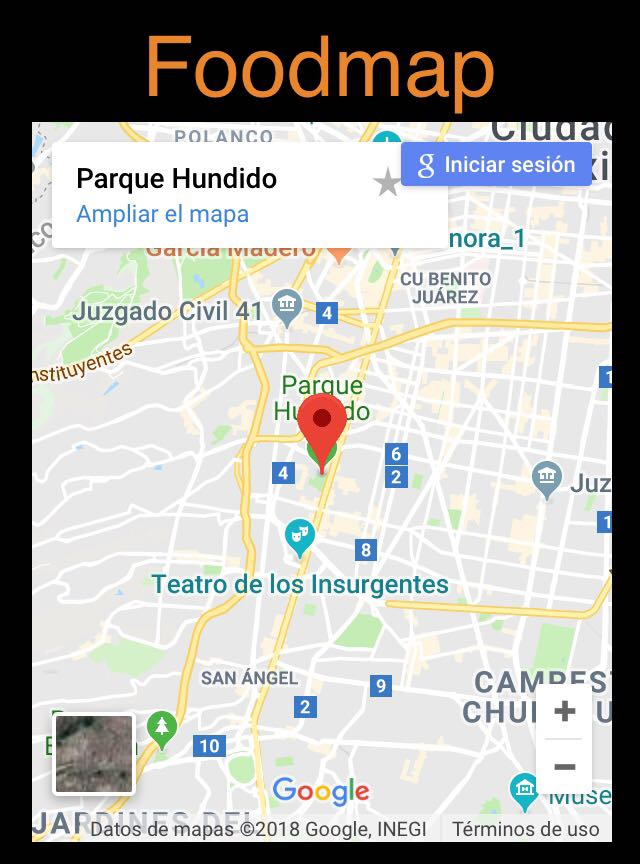

# Foodmap

* **Track:** _Common Core_
* **Empresa:** _Proyecto elaborado por alumna de [Laboratoria](http://www.laboratoria.la/)_
* **Enlace:** [Enlace al proyecto](https://superliza.github.io/foodmap/)

---

Es una WebApp que permite a los usuarios buscar por nombre de restaurante en un input y al darle click a un restaurante, sale un modal con su información.

**Se utilizaron las siguientes tecnologías:**

* `Javacript`: Lenguaje de programación del lado del cliente.
* `jQuery`: Librería de Javascript para manipular el DOM.
* `MaterializeCSS`: Framework responsivo de CSS basado en Material Design.
* `CSS`: Lenguaje de diseño para definir y crear la presentación de un documento HTML.
* `HTML`: Lenguaje de marcado para crear la estructura de la página.

## Capturas

